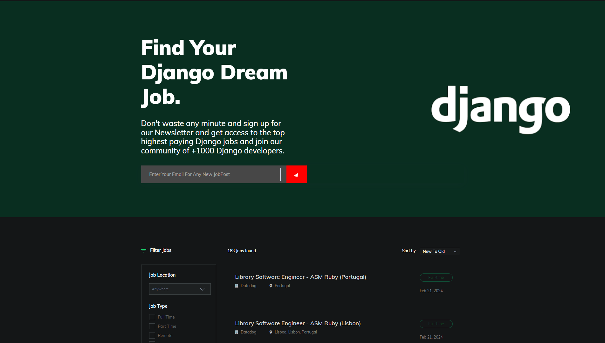

# Jop Portal For Django
<p align="center">
    
</p>
<p align="center">
    <a href="#Git" alt="Git">
        
    </a>
    <a href="https://github/OZX-OG" alt="Github">
        
    </a>
    <a href="https://www.djangoproject.com/" alt="Django">
        
    </a>
    <a href="https://python.org/" alt="Python">
        
    </a>
</p>

This Django-based job portal aggregates Django-related job listings from Indeed and LinkedIn using Selenium for web scraping. Focused solely on Django jobs, the portal streamlines the job search process. Additionally, it includes a RESTful API for programmatically accessing job data.


## Installation

1. Make sure you have Python 3.x installed on your system.

2. Clone the repository:
```bash
git clone https://github.com/OZX-OG/JobPortal-django.git
```
3. Set Up Virtual Environment:
Ensure you have virtual environments installed on your machine. If not, install them using:
```bash
pip install virtualenv
```

4. Create a Virtual Environment:
Navigate to the project directory and create a virtual environment:
```bash
virtualenv venv
```

5. Activate the Virtual Environment:

- On Windows:
```bash
venv\Scripts\activate
```
- On Unix or MacOS::
```bash
source venv/bin/activate
```

6. Install the required packages:

```bash
pip install -r requirements.txt
```

7. Start the Server:
Once all requirements are installed, start the Django server:
```bash
python manage.py runserver
```

8. Access the Portal:
Open a web browser and navigate to the URL displayed in the terminal where the Django server is running:
## API Information:

1. **Random Job Endpoint:**
   - Endpoint: `/api/random/`
   - Description: Access this endpoint to retrieve a random job listing without authentication. Each refresh provides a new random job.
   - JSON Response Template:
     ```json
     {
       "title": "{{ Job Title }}",
       "company": "{{ Company Name }}",
       "link": "{{ Job Link }}",
       "salary": "Not specified",
       "specific_location": "{{ Location }}",
       "publish_date": "{{ Publish Date }}"
     }
     ```

2. **Authenticated Job Listings Endpoint:**
   - Endpoint: `/api/`
   - Description: Requires authentication with a token in the header (`'Authorization': 'Token {{ Your Token }}'`) to access all jobs in the database.
   - JSON Request Header Template (for authentication):
     ```json
     {
       "Authorization": "Token {{ Your Token }}"
     }
     ```
   - JSON Response Template:
     ```json
     {
       "source": "{{ Source }}",
       "location": ["{{ Location }}"],
       "title": "{{ Job Title }}",
       "company": "{{ Company Name }}",
       "job_link": "{{ Job Link }}",
       "company_url": "{{ Company URL }}",
       "image_url": "{{ Image URL }}",
       "salary": "Not specified",
       "specific_location": "{{ Location }}",
       "applications": "{{ Applications }}",
       "seniority_level": "{{ Seniority Level }}",
       "employment_type": "{{ Employment Type }}",
       "Industries": "{{ Industries }}",
       "post_date": "{{ Post Date }}",
       "remote": "{{ Remote }}",
       "publish": "{{ Publish Date }}",
       "slug": "{{ Slug }}",
       "is_active": "{{ Is Active }}"
     }
     ```
   - Error Message Template (if token not provided):
     ```json
     {
         "detail": "Authentication credentials were not provided."
     }
     ```

Replace placeholders (`{{ }}`) with actual data when using the API endpoints. For the authenticated endpoint, ensure you include the correct token in the request header to access the job listings.


## Usage

To utilize the job portal:

- Ensure Django is installed and the project dependencies are met.
- Run the Django server.
- Navigate to the portal's URL in a web browser.
- Use the search functionality to find Django job listings fetched from Indeed and LinkedIn.
## Contributing

Contributions are always welcome!

Feel free to submit pull requests or open issues for any enhancements or bug fixes.


## Acknowledgements

- Special thanks to the developers of Django, Selenium, Indeed, and LinkedIn for their contributions and APIs that made this project possible.
- Thanks to the open-source community for their continuous support and valuable feedback.
